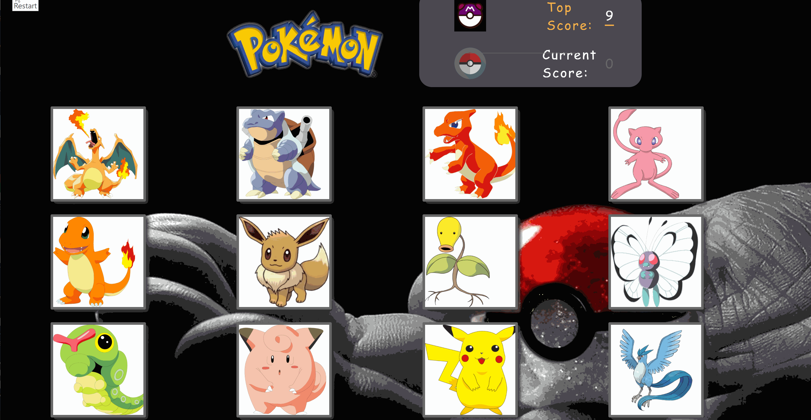

#Pokemon Click Game!

##Click [here](https://protected-plateau-36560.herokuapp.com/) to play!

Pokemon Click is a memory game made using React. 

Click as many pokemon as possible without clicking the same one. See how many Pokemon you can catch!

## Yarn Packages
* node-sass-chokidar
* npm-run-all
* react
* react-bootstrap
* react-dom
* react-scripts

This game was created using `create-react-app`.
`Scss` was also used for the design.

## Authors

* **Leeland Clenista**
